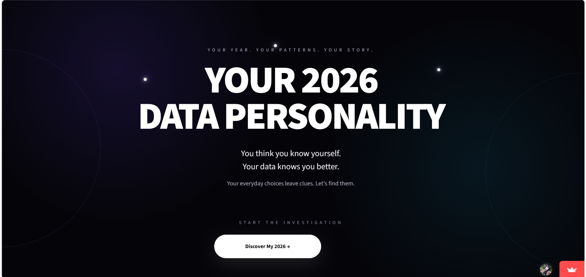
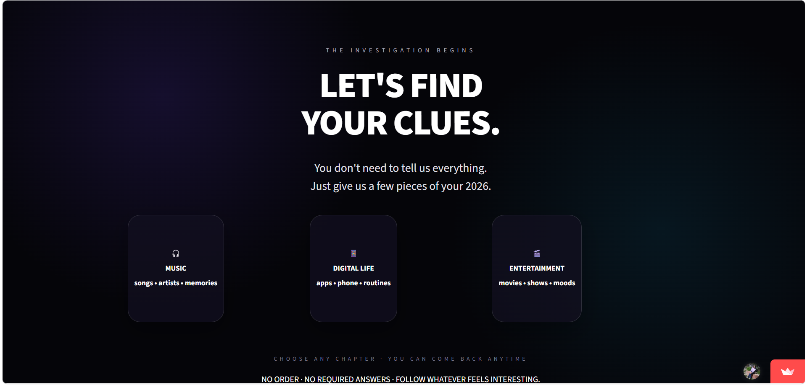
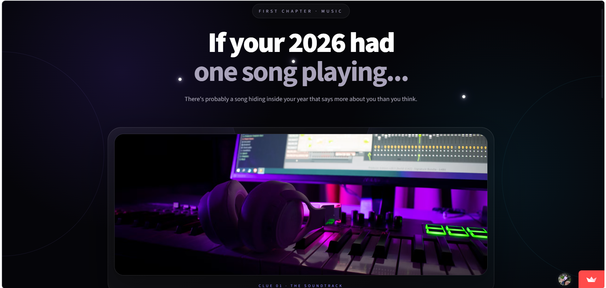
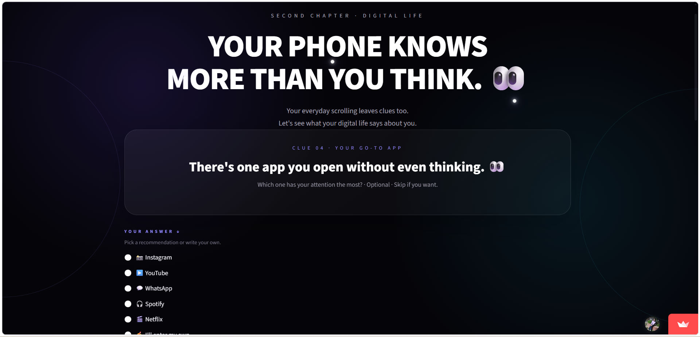
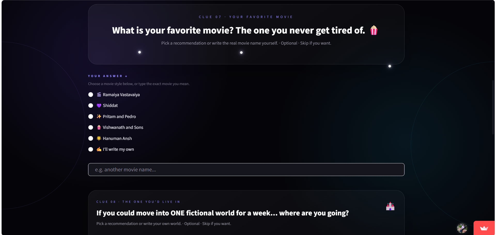
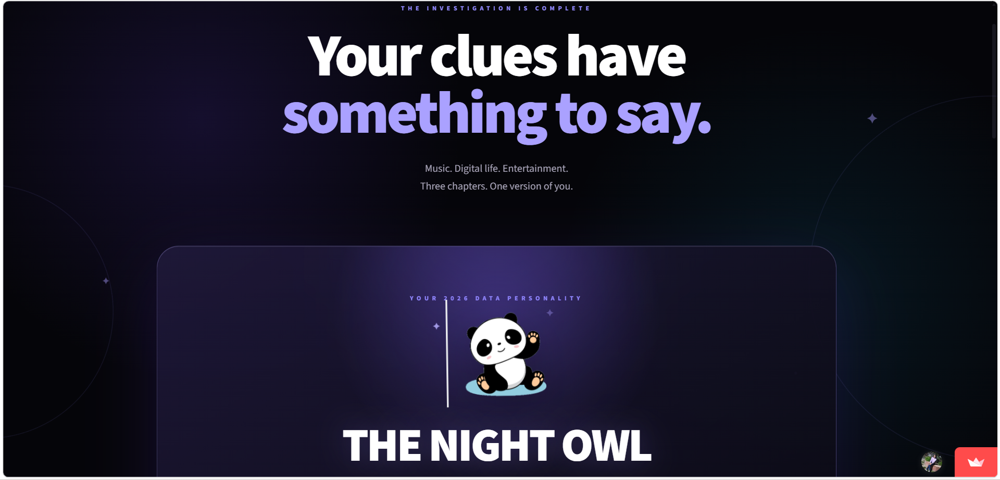
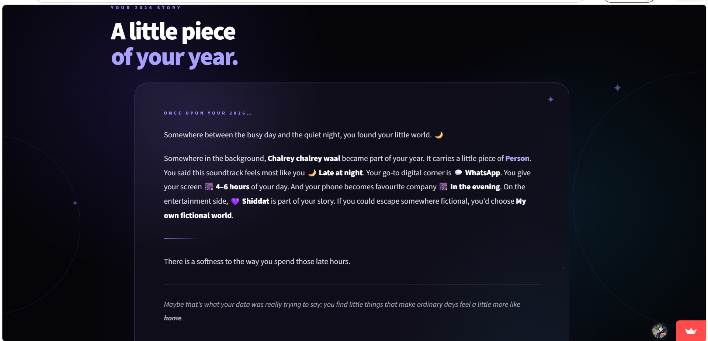
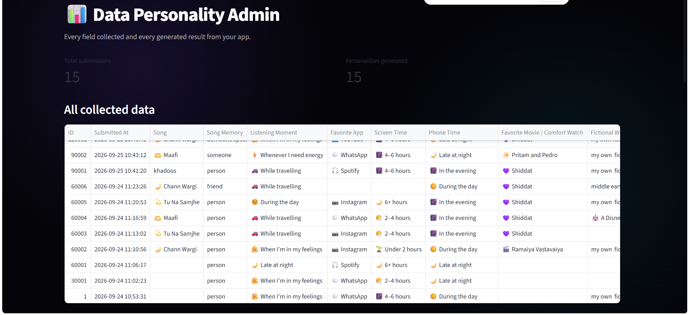

# ✦ YOUR 2026 DATA PERSONALITY

> **You think you know yourself. Your data knows you better.**

Hey! 👋 Welcome to **YOUR 2026 DATA PERSONALITY** — an interactive Streamlit app that turns your everyday choices, habits, and preferences into a unique personality and a personalized story.

---

##  What is this?

What if your favorite song, the apps you use, your screen time, your favorite movie, and the fictional worlds you love could reveal something about you?

**YOUR 2026 DATA PERSONALITY** explores exactly that.

Instead of filling out a traditional personality test, users explore different chapters and leave behind small clues about themselves.

Those clues are then used to generate:

-  A unique personality
-  A personalized story
-  A visual personality reveal

> **The more clues you give, the more personalized your personality becomes.**

---

## 🌐 Live Demo

🔗 **Live App:**  
https://storybyme.streamlit.app/

---

##  The Journey

The application takes the user through different chapters:

**Landing → Investigation → Music → Digital Life → Entertainment → Personality Reveal → Story Reveal**

---

##  Landing

The journey begins with a simple question:

**What does your data say about you?**



---

##  Investigation

The investigation page introduces the three main chapters of the experience:

-  Music
-  Digital Life
-  Entertainment

Users can choose which part of their life they want to explore.



---

##  Music Chapter

The Music chapter explores the emotional side of the user's music choices.

Users can share things like:

- Favorite song
- A memory connected with the song
- When they usually listen to it

The answers become small clues about their personality.



---

##  Digital Life Chapter

The Digital Life chapter looks at everyday phone and app usage.

Users can provide:

- Favorite app
- Screen-time range
- When they use their phone the most

These small digital habits become part of the personality generation.



---

##  Entertainment Chapter

The Entertainment chapter explores the user's movie and fictional-world preferences.

Users can share:

- Favorite movie / comfort watch
- Favorite fictional world
- Viewer type



---

## ✦ Personality Reveal

Once enough clues are collected, the application generates a personality based on the user's answers.

Some possible personalities include:

-  **THE NIGHT OWL EXPLORER**
-  **THE DIGITAL EXPLORER**
-  **THE COMFORT SEEKER**
-  **THE DREAMER**
-  **THE PLOT HUNTER**
-  **THE LITTLE MOMENT COLLECTOR**
-  **THE BALANCED EXPLORER**
-  **THE QUIETLY CURIOUS ONE**



---

##  Story Reveal

The final part of the experience turns the collected clues into a short personalized story.

The story connects the user's:

-  Music
-  Memories
-  Digital habits
-  Entertainment choices
-  Personality

into one small story about their 2026.



---

##  Admin Dashboard

The application also includes a password-protected Admin Dashboard.

The admin can view the submitted data of users, including:

- User ID
- Submission date and time
- Favorite song
- Song memory
- Listening moment
- Favorite app
- Screen time
- Phone usage time
- Favorite movie / comfort watch
- Fictional world
- Viewer type
- Personality
- Personality description
- Generated story



---

##  Database

User submissions are stored in a **TiDB Cloud MySQL-compatible database**.

The application stores fields such as:

```text
id
created_at
song
memory
moment
favorite_app
screen_time
phone_time
favorite_movie
fictional_world
viewer_type
personality
personality_description
generated_story
```

---

##  Tech Stack

-  Python
-  Streamlit
-  MySQL / TiDB Cloud
-  pandas
-  NumPy
-  Matplotlib
-  Seaborn
-  Streamlit Secrets
-  Streamlit Community Cloud
-  Git & GitHub

---

##  How Personality Generation Works

The personality is generated using **rule-based Python logic** based on the clues provided by the user.

Different combinations of music preferences, digital habits, and entertainment choices can lead to different personality types.

```text
Music Clues
     +
Digital Life Clues
     +
Entertainment Clues
     ↓
Personality Logic
     ↓
Personality
     ↓
Personalized Story
```

The project does not use machine learning.

Instead, Python conditional logic is used to connect different user choices with different personality types.

---

##  Data Flow

```text
User
  ↓
Interactive Questions
  ↓
Streamlit Session State
  ↓
Personality Generation
  ↓
Story Generation
  ↓
TiDB Cloud Database
  ↓
Admin Dashboard
```

---

##  Data & Security

The application uses **Streamlit Secrets** to manage sensitive credentials.

Database credentials and the admin password are not directly exposed in the main application code.

The Admin Dashboard is password protected so that submitted user information can only be accessed through the admin section.

---

##  Design

The application was designed to feel more like an interactive experience than a traditional questionnaire.

### Design Elements

-  Dark cinematic background
-  Soft purple accents
-  Glass-style cards
-  Rounded interactive buttons
-  Animations
-  Chapter-based navigation
-  Personality-based visuals
-  Story-style final reveal

The goal was to make the user feel like they are **discovering themselves**, rather than simply filling out a form.

---

##  Key Features

-  Music-based personality clues
-  Digital-life exploration
-  Entertainment preferences
-  Rule-based personality generation
-  Personalized story generation
-  TiDB Cloud database storage
-  Password-protected admin dashboard
-  Custom Streamlit interface
-  Cloud deployment
-  Persistent user submissions
-  Modular Python application structure

---

## 🚀 Run The Project Locally

### 1. Clone the repository

```bash
git clone lakshmi1810-create/data-personality-2026
```

### 2. Open the project folder

```bash
cd YOUR-2026-DATA-PERSONALITY
```

### 3. Install the required libraries

```bash
pip install -r requirements.txt
```

### 4. Configure Streamlit Secrets

Create:

```text
.streamlit/secrets.toml
```

Add your TiDB Cloud database credentials and admin password in the Streamlit Secrets configuration.

### 5. Run the application

```bash
streamlit run app.py
```

---

##  Deployment

The application is deployed using **Streamlit Community Cloud**.

The deployed application connects to the TiDB Cloud database so that user submissions can be stored online.

### Live Application

🔗 https://storybyme.streamlit.app/

---

##  What I Learned

Through this project, I worked with:

- Python application development
- Streamlit
- Streamlit Session State
- MySQL database connectivity
- TiDB Cloud
- SQL queries
- Database insertion and retrieval
- Rule-based logic
- Python modularization
- Streamlit Secrets
- Git and GitHub
- Cloud deployment
- Interactive UI design
- Data-driven storytelling

---

## 🎯 Project Objective

The main objective of this project was to combine **Python, data, database management, and interactive UI** into one complete application.

Instead of presenting data only through tables and charts, this project uses everyday user data to create an engaging and personalized experience.

---

##  Future Improvements

Possible future improvements include:

- More personality types
- More chapters and clues
- More detailed personality analysis
- Advanced data visualizations
- Personality history
- More interactive animations
- More personalized stories
- Additional analytics in the Admin Dashboard

---

##  The Idea Behind The Project

We usually think of data as numbers, tables, and charts.

But everyday data can also tell a story.

A song you repeatedly listen to.

An app you open every day.

A movie you watch when you need comfort.

A fictional world you would love to visit.

All of these little things become clues.

And together, those clues create:

# ✦ YOUR 2026 DATA PERSONALITY

> **You think you know yourself. Your data knows you better.**

---

##  Built With

**Python • Streamlit • MySQL • TiDB Cloud • pandas • NumPy • Matplotlib • Seaborn**

---

### ✦ Made with Python, data, and a lot of little clues. ♡
